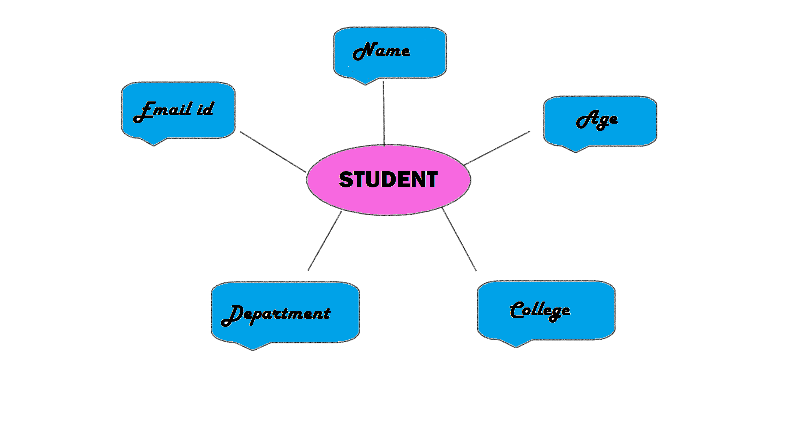
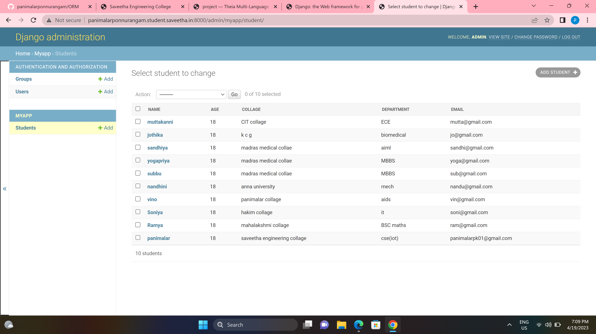

# Ex02 Django ORM Web Application

## AIM
To develop a Django application to store and retrieve data from a student database using Object Relational Mapping(ORM).

## Entity Relationship Diagram



## DESIGN STEPS

### STEP 1:

Clone the repository from github.

### STEP 2:

Create an admin interface for Django.

### STEP 3:

Create an app and edit settings.py

### STEP 4:

Makemigrations and migrate the changes.

### STEP 5:

Create admin user and write python code for admin and models.

### STEP 6:

Make all the migrations to 'myapp'.

### STEP 7:

Create an student database with 10 fileds using runserver command.

## PROGRAM

```admin.py

from django.contrib import admin
from .models import Student,StudentAdmin
admin.site.register(Student,StudentAdmin)


models.py

from django.db import models
from django.contrib import admin
class Student (models.Model):
    name=models.CharField(max_length=100)
    age=models.IntegerField()
    collage=models.CharField(max_length=100)
    department=models.CharField(max_length=100)
    email=models.EmailField()


class StudentAdmin(admin.ModelAdmin):
    list_display=('name','age','collage','department','email')    


```

## OUTPUT




## RESULT
The program for creating an  Student database using ORM is executed Successfully.
